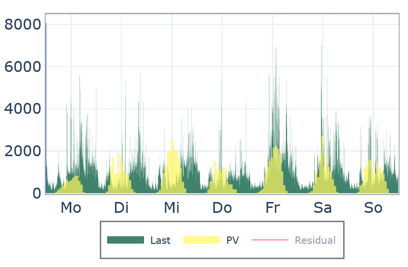

# Los gehts!

Lass uns gemeinsam Schritt für Schritt ein Stromnetz bauen und lernen, wie viel Strom in deinem Haushalt verbraucht wird!

## Schritt 1: Eine Datei laden

### Aufgabe:
Zuerst laden wir ein schon angefangenes Netz als Startpunkt in die App. Gehe dazu auf das Menü oben links auf "Konfiguration laden".
Den Link zur Beispieldatei findest du in der Tutorial-Hilfe (Button (?) unten).
### Hilfe:
Du kannst fertige Konfigurationen ganz einfach in die App laden. Dazu brauchst du eine passende Datei.
Eine solche Datei bekommst du, wenn du in den Einstellungen auf den Button klickst oder zum [Download hier](https://github.com/felixhus/stromhausfall/blob/main/assets/start_konfiguration.json)

Dein Netz sollte dann so aussehen:

## Schritt 2: Ein Haus hinzufügen

### Aufgabe:
Klick auf das Haus-Symbol in der linken Spalte, um ein neues Haus hinzuzufügen.
### Hilfe:
Mit den Buttons in der linken Spalte kannst du neue Objekte zum Netz hinzufügen. Du kannst diese dann mit der Maus auf der Oberfläche verschieben.

Dein Netz sollte dann so aussehen:

## Schritt 3: Das Haus mit dem Netz verbinden

### Aufgabe:
Um das Haus mit dem Netz zu verbinden, klicke auf den untersten Button der linken Spalte, die Leitung. Dann klick zuerst auf das Haus, dann auf den Transformator.
### Hilfe:
Der Leitungs-Modus bleibt aktiv, bis du ihn durch erneutes Klicken des Buttons oder mit der "ESC"-Taste beendest.

Dein Netz sollte dann so aussehen:

## Schritt 4: Eine falsche Leitung ziehen

### Aufgabe:
Versuch doch mal, zwei Häuse direkt miteinander zu verbinden. Das wird nicht klappen, es kommt eine Fehlermeldung. Das ist nicht schlimm, 
manche Objekte kann man wie in der echten Welt nicht direkt miteinander verbinden.
### Hilfe:
Die Fehlermeldung sieht so aus:

## Schritt 5: Namen des Hauses ändern

### Aufgabe:
Wenn du auf das Haus klickst, öffnet sich ein Fenster, in dem du es bearbeiten kannst. Du kannst dem Haus einen Namen geben.
Nachdem du auf Speichern geklickt hast, wird der Name gespeichert.
### Hilfe:
Jedes Objekt hat das **Eigenschaften** Fenster auf der rechten Seite, in welchem du verschiedene Dinge einstellen kannst. 
Das Haus lädt sich in seiner Grundeinstellung beim Speichern selbstständig ein Lastprofil, da musst du dich um nichts kümmern.

## Schritt 6: Einen Verteiler hinzufügen

### Aufgabe:
Füge nun einen Verteiler hinzu (vorletztes Element in der linken Spalte) und verbinde ihn mit dem Transformator. Bei der Nachfrage zur Spannungsebene wählst du 400 V aus.
### Hilfe:
Der Verteiler hat keinen eigenen elektrischen Verbrauch, er ist wie eine Mehrfachsteckdose. Du kannst alle möglichen Dinge mit ihm verbinden.

Dein Netz sollte dann so aussehen:

## Schritt 7: Eine Solaranlage hinzufügen

### Aufgabe:
Füge jetzt eine Solaranlage und ein Haus hinzu und verbinde beide mit dem Verteiler aus Schritt 5.
### Hilfe:
Dein Netz sollte dann so aussehen:

## Schritt 8: Die Solaranlage konfigurieren

### Aufgabe:
Du kannst die Solaranlage jetzt einstellen. Du kannst eine Postleitzahl eingeben, auswählen in welche Himmelsrichtung die Anlage zeigt, wie große sie ist (=Wie viel Energie sie einfangen kann) und welche Neigung sie hat.
Die beste Ausrichtung is nach Süden und die beste Neigung auf einem Steildach. Das kannst du fürs erste übernehmen. Speichern nicht vergessen!
### Hilfe:
**Postleitzahl:** Hier kannst du deine Postleitzahl eintragen. Das Programm lädt dann die Sonneneinstrahlung für dich.

**Leistung:** Die elektrische Leistung der Solaranlage. Je größer die Anlage ist, desto höher ist die Leistung. Sie bestimmt, wie viel Energie die Anlage produziert.
Für ein Haus ist ein typischer Wert 5 kWp.

**Neigung:** Die Energieproduktion ist auch davon abhängig, wie die Solaranlage installiert ist. Am besten ist es, wenn sie auf einem Steildach auf dem Haus angebracht wird.

Du wirst sehen, dass die Anlage nicht jeden Tag gleich viel Energie produziert. Das liegt am unterschiedlichen Wetter der verschiedenen Tage.

Wenn du möchtest, kannst du bei den Einstellungen die Kalenderwoche verändern und ausprobieren, wie die Solaranlage sich im Winter, Sommer oder Herbst verhält (Aktualisieren nicht vergessen!)

Das Menü sollte nach dem Speichern so aussehen:

## Schritt 9: Das Netz berechnen

### Aufgabe:
Glückwunsch, dein Netz ist fertig! Du kannst es nun über den "Berechnen" Button simulieren lassen. Details zu den Ergebnissen findest du in der Hilfe unten.
### Hilfe:
Du kannst in dem Ergebnis zwei Dinge sehen:

**Gesamtleistung**: In Grün siehst du, wie viel Leistung zu jeden Zeitpunkt über die Woche von allem Verbrauchern genutzt wird.

**Solareinspeisung**: In Gelb sieht du, wie viel Leistung die Solaranlage gleichzeitig liefert.

Wenn du in der Legende auf "Residual" klickst, erscheint eine rote Kurve. Dies ist die Residuallast, also wie viel Leistung das Stromnetz liefern muss. 
Ist die rote Linie unter 0, liefert die Solaranlage mehr Energie, als die Haushalte verbrauchen.

Durch Klicken auf einen bestimmten Tag kannst du in den Graphen hinein zoomen. Klickst du auf "Tot", öffnet er sich in groß.

## Schritt 10: Einzelnen Zeitpunkt auswerten

### Aufgabe:
Mit dem Slider unter dem Netz kannst du einzelne Zeitpunkte auswählen. Du siehst jeweils die Leistung auf jeder Leitung 
und der blaue Strich in dem Ergebnis-Graphen zeigt dir den Zeitpunkt an.
### Hilfe:
Zusätzlich wird die aktuell aus dem Netz bezogene bzw. eingespeiste Leistung genannt.
