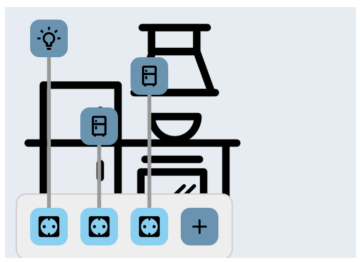
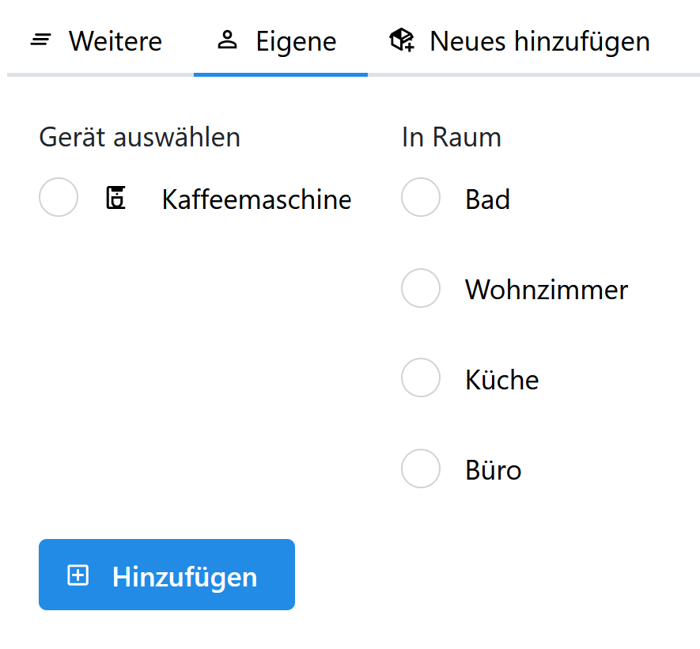

# Los gehts!

Lass uns gemeinsam Schritt für Schritt ein Stromnetz bauen und lernen, wie viel Strom in deinem Haushalt verbraucht wird!

## Schritt 1: Eine Datei laden

### Aufgabe:
Zuerst laden wir ein schon angefangenes Netz als Startpunkt in die App. Gehe dazu auf das Menü oben links auf "Konfiguration laden".
Den Link zur Beispieldatei findest du in der Tutorial-Hilfe (Button (?) unten).
### Hilfe:
Du kannst fertige Konfigurationen ganz einfach in die App laden. Dazu brauchst du eine passende Datei.
Eine solche Datei bekommst du, wenn du in den Einstellungen auf den Button klickst oder zum [Download hier](https://github.com/felixhus/stromhausfall/blob/main/assets/start_konfiguration.json)

Dein Netz sollte dann so aussehen:

## Schritt 2: Ein Haus hinzufügen

### Aufgabe:
Klick auf das Haus-Symbol in der linken Spalte, um ein neues Haus hinzuzufügen.
### Hilfe:
Mit den Buttons in der linken Spalte kannst du neue Objekte zum Netz hinzufügen. Du kannst diese dann mit der Maus auf der Oberfläche verschieben.

Dein Netz sollte dann so aussehen:

## Schritt 3: Das Haus mit dem Netz verbinden

### Aufgabe:
Um das Haus mit dem Netz zu verbinden, klicke auf den untersten Button der linken Spalte, die Leitung. Dann klick zuerst auf das Haus, dann auf den Transformator.
### Hilfe:
Der Leitungs-Modus bleibt aktiv, bis du ihn durch erneutes Klicken des Buttons oder mit der "ESC"-Taste beendest.

Dein Netz sollte dann so aussehen:

## Schritt 4: Eine falsche Leitung ziehen

### Aufgabe:
Versuch doch mal, zwei Häuse direkt miteinander zu verbinden. Das wird nicht klappen, es kommt eine Fehlermeldung. Das ist nicht schlimm, 
manche Objekte kann man wie in der echten Welt nicht direkt miteinander verbinden.
### Hilfe:
Die Fehlermeldung sieht so aus:

## Schritt 5: Namen des Hauses ändern

### Aufgabe:
Wenn du auf das Haus klickst, öffnet sich ein Fenster, in dem du es bearbeiten kannst. Du kannst dem Haus einen Namen geben.
Nachdem du auf Speichern geklickt hast, wird der Name gespeichert. Außerdem wird ein zufälliges Lastprofil geladen.
### Hilfe:
Jedes Objekt hat das **Eigenschaften** Fenster auf der rechten Seite, in welchem du verschiedene Dinge einstellen kannst. 
Das Haus lädt sich in seiner Grundeinstellung beim Speichern selbstständig ein Lastprofil, da musst du dich um nichts kümmern.

## Schritt 6: Einen Verteiler hinzufügen

### Aufgabe:
Füge nun einen Verteiler hinzu (vorletztes Element in der linken Spalte) und verbinde ihn mit dem Transformator. Bei der Nachfrage zur Spannungsebene wählst du 400 V aus.
### Hilfe:
Der Verteiler hat keinen eigenen elektrischen Verbrauch, er ist wie eine Mehrfachsteckdose. Du kannst alle möglichen Dinge mit ihm verbinden.

Dein Netz sollte dann so aussehen:

## Schritt 7: Eine Solaranlage hinzufügen

### Aufgabe:
Füge jetzt eine Solaranlage und ein Haus hinzu und verbinde beide mit dem Verteiler aus Schritt 5.
### Hilfe:
Dein Netz sollte dann so aussehen:

## Schritt 8: Die Solaranlage konfigurieren

### Aufgabe:
Du kannst die Solaranlage jetzt einstellen. Du kannst eine Postleitzahl eingeben, auswählen in welche Himmelsrichtung die Anlage zeigt, wie große sie ist (=Wie viel Energie sie einfangen kann) und welche Neigung sie hat.
Die beste Ausrichtung is nach Süden und die beste Neigung auf einem Steildach. Das kannst du fürs erste übernehmen. Speichern nicht vergessen!
### Hilfe:
**Postleitzahl:** Hier kannst du deine Postleitzahl eintragen. Das Programm lädt dann die Sonneneinstrahlung für dich.

**Leistung:** Die elektrische Leistung der Solaranlage. Je größer die Anlage ist, desto höher ist die Leistung. Sie bestimmt, wie viel Energie die Anlage produziert.
Für ein Haus ist ein typischer Wert 5 kWp.

**Neigung:** Die Energieproduktion ist auch davon abhängig, wie die Solaranlage installiert ist. Am besten ist es, wenn sie auf einem Steildach auf dem Haus angebracht wird.

Du wirst sehen, dass die Anlage nicht jeden Tag gleich viel Energie produziert. Das liegt am unterschiedlichen Wetter der verschiedenen Tage.

Wenn du möchtest, kannst du bei den Einstellungen die Kalenderwoche verändern und ausprobieren, wie die Solaranlage sich im Winter, Sommer oder Herbst verhält (Aktualisieren nicht vergessen!)

Das Menü sollte nach dem Speichern so aussehen:

## Schritt 9: Das Netz berechnen

### Aufgabe:
Glückwunsch, dein Netz ist fertig! Du kannst es nun über den "Berechnen" Button simulieren lassen. Details zu den Ergebnissen findest du in der Hilfe unten.
### Hilfe:
Du kannst in dem Ergebnis zwei Dinge sehen:

**Gesamtleistung**: In Grün siehst du, wie viel Leistung zu jeden Zeitpunkt über die Woche von allem Verbrauchern genutzt wird.

**Solareinspeisung**: In Gelb sieht du, wie viel Leistung die Solaranlage gleichzeitig liefert.

Wenn du in der Legende auf "Residual" klickst, erscheint eine rote Kurve. Dies ist die Residuallast, also wie viel Leistung das Stromnetz liefern muss. 
Ist die rote Linie unter 0, liefert die Solaranlage mehr Energie, als die Haushalte verbrauchen.

Durch Klicken auf einen bestimmten Tag kannst du in den Graphen hinein zoomen. Klickst du auf "Tot", öffnet er sich in groß.

## Schritt 10: Einzelnen Zeitpunkt auswerten

### Aufgabe:
Mit dem Slider unter dem Netz kannst du einzelne Zeitpunkte auswählen. Du siehst jeweils die Leistung auf jeder Leitung 
und der blaue Strich in dem Ergebnis-Graphen zeigt dir den Zeitpunkt an.
### Hilfe:
Zusätzlich wird die aktuell aus dem Netz bezogene bzw. eingespeiste Leistung genannt.

## Schritt 11: Ein Haus selbst basteln

### Aufgabe:
Jetzt kommen wir zu deinem eigenen Haushalt! In deinem Netz kannst du ein Haus selbst zusammenbasteln. Mehr als eins sind nicht möglich.
Wir starten, indem du auf das gewünschte Haus klickst, ihm einen Namen gibst und dann im Menü "Selbst basteln" auswählst. Das Haus öffnet sich automatisch.
### Hilfe:
Du kannst immer nur ein Haus gleichzeitig im Detail konfigurieren. Möchtest du das Haus wechseln, kannst du das alte Haus wieder auf "Fertiges Profil" stellen. Danach kannst du ein neues auswählen.

## Schritt 12: Der Haushalt

### Aufgabe:
Dein Haushalt besteht aus vier Räumen. In jedem Raum gibt es eine Steckdosenleiste und eine schon angeschlossene Lampe.
Wenn du auf die Lampe klickst, öffnet sich wieder das Menü.
### Hilfe:
Das Menü sieht so aus:

## Schritt 13: Die Lampen

### Aufgabe:
Jetzt kannst du eins der hinterlegten Lastprofile für die Lampe auswählen. Wenn du es speicherst, wird es dir für den ausgewählten Wochentag angezeigt.
Um die verschiedenen Lastprofile auszuwählen, kannst du in jedem Raum ein anderes Profil einstellen.
### Hilfe:
Das Menü sieht mit Lastprofil 2 so aus:

## Schritt 14: Geräte hinzufügen

### Aufgabe:
Jetzt fügen wir neue Geräte hinzu, wir starten in der Küche. Klicke auf das + in der Steckdosenleiste und wähle den Kühlschrank aus. Füge dann noch einen zweiten Kühlschrank hinzu.
### Hilfe:
Die Liste, welche sich öffnet, enthält für den jeweiligen Raum typische Geräte. Wie du andere Geräte hinzufügen kannst, lernen wir später.

Die Küche sieht mit den neuen Kühlschränken jetzt so aus:

## Schritt 15: Kühlschränke einstellen

### Aufgabe:
Der Kühlschrank ist den ganzen Tag angeschaltet. Du kannst den Typ des Kühlschranks in seinem Menü auswählen, wenn du draufklickst.
Wähle für den einen Kühlschrank ein altes Modell und für den anderen ein neues aus.
### Hilfe:
Das Lastprofil des Kühlschranks in jeden Tag gleich. Du kannst es nur durch die Auswahl des Gerätetyps ändern, aber nicht, wann der Kühlschrank ausgeschaltet ist.
Das ist so für alle Geräte, die dauerhaft angeschaltet sind.

## Schritt 16: Gerät an- und ausschalten

### Aufgabe:
Du kannst Geräte ganz einfach an- und ausschalten ohne sie zu löschen. Dazu klickst du einfach auf die Steckdose, die mit dem Gerät verbunden ist.
Das Gleiche passiert, wenn du im Menü unten rechts den Schalter betätigst.
### Hilfe:
Das An- und Ausschalten kann praktisch sein, wenn du verschiedene Geräte vergleichen willst. Du kannst sie alle hinzufügen und immer nur eines anschalten.
Über die Farbe der Steckdosen siehst du sofort, welches Gerät angeschaltet ist:

## Schritt 17: Waschmaschine hinzufügen

### Aufgabe:
Jetzt wollen wir ein Gerät zur Küche hinzufügen, das nicht in der Liste beim + ist. Dazu klicken wir nach dem + auf "Weitere".
In der Liste sind alle Geräte, die es in der App gibt. Wähle die Waschmaschine aus und klicke auf "Hinzufügen".
### Hilfe:
Du kannst hier auch auf der rechten Seite den Raum auswählen, in dem das Gerät hinzugefügt werden soll.

## Schritt 18: Waschgänge festlegen

### Aufgabe:
Die Waschmaschine ist nicht den ganzen Tag angeschaltet. Du kannst selbst festlegen, wann sie läuft.
Dazu wählst du wieder ein Lastprofil aus. Dann wählst du den Wochentag, an dem die Waschmaschine laufen soll.
Nachdem du die Uhrzeit eingegeben hast, speicherst du.
Füge so einen Waschgang am Montag um 15:30 Uhr und am Donnerstag um 07:00 Uhr hinzu.
### Hilfe:
Hier siehst du das Lastprofil der Waschmaschine, am Anfang wird viel Strom gebraucht, um das Wasser aufzuheizen. 
Am Ende geht die Leistung beim Schleudern noch ein paar mal hoch.

## Schritt 19: Vollständiges Lastprofil

### Aufgabe:
Jetzt wollen wir Berechnen, wo im Haus wie viel Strom verbraucht wird. Klicke dazu auf "Berechnen".
Nach kurzer Zeit erscheint ein Graph, in dem du siehst, welches Gerät wie viel Strom verbraucht.

### Hilfe:
Wenn du auf "Legende anzeigen" klickst, siehst du welche Farbe zu welchem Gerät gehört. Du kannst durch einen Doppelklick auf eine Farbe in der Legende alle anderen ausblenden.
Willst du den Graphen in groß sehen? Dann klick auf "Tot", du kannst hier auch zoomen!

## Schritt 20: Genutzte Energie

### Aufgabe:
Die Darstellung unter dem Lastprofil zeigt an, welcher Raum und welches Gerät wie viel Energie genutzt hat.
Du kannst so zum Beispiel verschiedene Arten von Geräten vergleichen. Der Plot kann bei dir anders aussehen, je nachdem wie du deine Geräte eingestellt hast.

### Hilfe:
Wenn du über einen Bereich des Plots fährst, siehst du, wie viele kWh das Gerät im Jahr verbraucht, wenn es immer so wie in der nachgestellten Woche genutzt wird.

## Schritt 21: Stromkosten der Geräte

### Aufgabe:
Unter dem Reiter "Kosten" kannst du sehen, wie viel der Stromverbrauch von jedem einzelnen Gerät im Jahr kostet, wenn du es so benutzt wie in der nachgestellten Woche.
Den Strompreis kannst du in den Einstellungen anpassen, je nachdem wie er für deinen Haushalt ist.

### Hilfe:

## Schritt 22: Zurück zum Netz

### Aufgabe:
Geh jetzt zurück zum Netz. Wenn du auf dein Haus klickst siehst du, dass es jetzt das von den einzelnen Geräten gebildete Lastprofil hat.
Du erkennst dein Haus daran, dass es keine abgerundeten Ecken hat.

### Hilfe:

## Schritt 23: Aktuellen Stand speichern

### Aufgabe:
Du kannst dein erstelltes Netz und Haus speichern. Dazu klickst du im Menü oben rechts auf "Konfiguration speichern". Du kannst dann einen Dateinamen und einen Speicherort auswählen.
Diese Datei kannst du beim nächsten Mal wieder laden. Das ist in Schritt 1 beschrieben.

### Hilfe:

## Schritt 24: Ergebnisse herunterladen

### Aufgabe:
Um mehrere Berechnungen zu vergleichen, kannst du auch deine Ergebnisse herunterladen. Gehe dazu im Menü auf "Ergebnisse exportieren".
Nach ein paar Sekunden öffnet sich ein Fenster in dem du festlegen kannst, wo die Bilder der Ergebnisse gespeichert werden sollen. Guck sie dir danach doch einfach mal an!

### Hilfe:

## Schritt 25: Geschafft!

### Aufgabe:
Du hast es geschafft und kennst jetzt die grundlegenden Funktionen. Viel Spaß beim Erkunden!
Die nächsten Schritte beschreiben, wie du ein neues Gerät mit einem eigenen Lastprofil erstellst. Wenn du das nicht brauchst, kannst du das Tutorial schließen.

### Hilfe:

## Schritt 26: Eigenes Gerät hinzufügen

### Aufgabe:
Um ein eigenes Gerät hinzuzufügen, klickst du auf das + einer Steckdosenleiste und dann auf "Weitere". Jetzt wechselst du in den Reiter "Neues Hinzufügen".

### Hilfe:
Du siehst dieses Fenster:

## Schritt 27: Eigenes Gerät hinzufügen

### Aufgabe:
Gib dem Gerät einen eindeutigen Namen und wähle aus, ob es ein konstantes Lastprofil hat, das jeden Tag gleich ist, oder du die Einschaltpunkte variabel einstellen möchtest.

Außerdem kannst du über den Link ein Icon auswählen, seine ID kopieren und einfügen.

### Hilfe:
Ein Gerät mit einem konstanten Lastprofil hat ein Profil das genau einen Tag (1440 Minuten) lang ist. Dieses wiederholt sich jeden Tag.

Ein Gerät mit einem variablen Lastprofil hat ein kürzeres Profil, bei dem du beliebig viele Einschaltzeitpunkte festlegen kannst.

## Schritt 28: Eigenes Gerät hinzufügen

### Aufgabe:
Du brauchst das Lastprofil in einer CSV oder XLSX Datei. Wie diese formatiert sein muss, findest du in der Hilfe unten:

Lade die Datei in dem Dialogfeld hoch.

### Hilfe:
Eine Beispieldatei mit zwei Lastprofilen für eine Kaffeemaschine kannst du [hier herunterladen](https://github.com/felixhus/stromhausfall/blob/main/assets/Kaffeemaschine_Lastprofile.xlsx).
Deine Datei muss so formatiert sein wie das Beispiel unten zeigt. Dabei kannst du so viele Profile wie du möchtest hinzufügen.

Wenn die Profile nicht die gleichen Zeitschritte haben, kannst du wie in der Beispieldatei zusätzliche Seiten in der XLSX Datei nutzen.

|   time   | Profil 1 | Profil 2 |
|:--------:|:--------:|:--------:|
| 07:01:00 |   100    |    75    |
| 07:02:00 |   100    |   100    |
| 07:02:30 |   100    |   125    |
| 07:03:00 |   100    |   150    |
| 07:05:00 |    0     |   125    |
| 07:20:00 |    50    |   100    |

## Schritt 29: Eigenes Gerät hinzufügen

### Aufgabe:
Jetzt klickst du auf "Erstellen", wenn das erfolgreich war bekommst du eine Benachrichtigung.

Du kannst das Gerät jetzt über den Reiter "Eigene" auswählen, einen Raum bestimmen und zum Haus hinzufügen.

### Hilfe:

## Schritt 30: Eigene Geräte herunterladen

### Aufgabe:
Wenn du viele eigene Geräte hast, ist das hinzufügen bei jeder Nutzung der App mühsam. Du kannst alle Geräte zusammen in einer Datei im Menü oben rechts unter "Download eigene Geräte" herunterladen.

Beim nächsten Start der App musst du nur diese eine Datei im Reiter "Eigene" bei den weiteren Geräten hochladen.

### Hilfe:
Zum wieder Hochladen gehst du bevor du neue Geräte erstellst auf das + der Steckdosenleiste, auf "Weitere" un dann auf den Reiter "Eigene". Hier kannst du deine zuvor heruntergeladene Datei jetzt einfügen.

